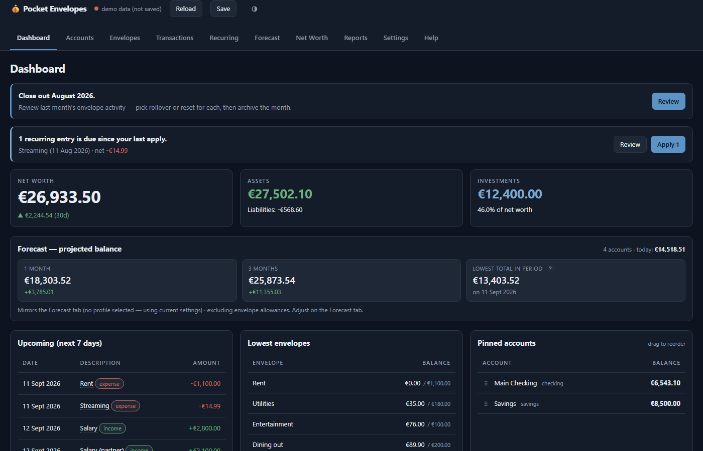

# Pocket Envelopes

**Envelope budgeting in one HTML file, with a forecast that tells you what you can safely spend.** Your budget lives in a single JSON file on your own machine. No account, no cloud, no subscription, no build step, no npm.



- **Envelopes** are virtual buckets you fund from your income; every expense draws down one (or several).
- **Forecast** projects each account and your *spendable* cash up to two years out, from your recurring entries, and tells you the lowest point in the period. That number is what "can I afford this?" actually depends on, and it is the thing spreadsheets get wrong and most budgeting apps do not attempt.
- **Everything else you would expect**: net-worth history, investment accounts, month-end close-out with rollover / reset / sweep-to-reserve policies, tags for cross-cutting reports, split transactions, CSV bank-statement import, undo, rolling backups, dark and light themes, a command palette.
- **Runs anywhere Python runs**, and reaches your phone through your own private network if you want it to.

## Why this and not YNAB, Actual, or a spreadsheet?

- **You own the file.** The whole budget is `finance-data.json` next to the server. Back it up, `git` it, open it in an editor. When the project stops existing, your data does not.
- **Nothing leaves your machine.** No sync service, no bank connection, no analytics, no CDN. The one third-party library (Chart.js) is vendored.
- **Forecasting is first-class.** Recurring income and bills, envelope allowances, and due-but-unrecorded entries are all folded into a day-by-day projection. The dashboard's "Lowest projected spendable" figure is the single number the app is built around.
- **It is small enough to read.** One HTML file and a 300-line Python server. No framework, no build. If something looks wrong you can find out why in an afternoon.

**Who it is not for.** There is no bank sync: you record transactions by hand or import a CSV statement. There is no multi-user permission model and no authentication; it is a household tool, not a service. And it is a single maintainer's opinionated budget app: features are added when the maintainer's own budget needs them.

## Try it in thirty seconds

Start the server (next section) and open <http://localhost:8765/?demo=1>. That loads a synthetic dataset and never writes anything to disk.

## Requirements

- **Python 3.8 or newer.** The server is standard library only; there is no `pip install`.
  - Windows 10/11: `winget install Python.Python.3.12`, or install **Python 3.12** from the Microsoft Store.
  - macOS: `brew install python`, or the installer from [python.org](https://www.python.org/downloads/).
  - Linux: usually present; otherwise `sudo apt install python3` or your distribution's equivalent.
- **A browser from mid-2023 or later**: Chrome or Edge 111+, Firefox 113+, Safari 16.2+ (the app uses `color-mix()` and ES2020). Phones and tablets included.

## Install and run

**Windows, the easy way: the installer.** Download `PocketEnvelopes-Setup-<version>.exe` from the [latest release](https://github.com/mvichosfm/pocket-envelopes/releases/latest) and run it. It needs no Python and no administrator rights: it bundles the official Python runtime, installs for your user only (under `%LOCALAPPDATA%\Programs\Pocket Envelopes`), and puts **Pocket Envelopes** in the Start menu. That shortcut starts the server if it is not already running and opens the app. Your budget is kept in `%LOCALAPPDATA%\PocketEnvelopes\finance-data.json`, which the uninstaller deliberately leaves in place. Tick *Start the server when I sign in* during setup if you use the app from a phone or as an installed app and want it always reachable.

> Windows SmartScreen will warn about an unrecognised publisher the first time, because the installer is not code-signed. Choose *More info → Run anyway*, or verify the SHA-256 printed on the release page first. You can also build the installer yourself with `installer\build.ps1` (see `installer/`).

**Windows, from the source folder**

```bat
launch.bat
```

Double-clicking it works too. Uses the Python already on your machine; if it is missing it prints install instructions and waits instead of failing silently.

**macOS / Linux**

```bash
./launch.sh
```

**Anywhere, by hand**

```bash
python3 serve.py
```

All three start the server on `http://localhost:8765/`, bound to this machine only, and open the app. The server shuts itself down after 30 minutes with no requests; set `IDLE_TIMEOUT=0` to keep it running, `PORT=…` to move it. Press Ctrl-C to stop it early.

On first run, click **Create new budget**. That writes `finance-data.json` into the folder; every later visit loads and saves it automatically.

> **Why a server for a single HTML file?** The server *is* the storage layer. It owns the JSON, hands it to whichever device asks, and writes it back atomically. Opening the app straight from the file system would leave it with nowhere to save. The file is named `pocket-envelopes.app` rather than `.html` precisely so a double-click cannot open it that way by accident.

## Using the refreshed interface

The Dashboard leads with **Spendable today** (recorded cash less positive
envelope reservations) and **Lowest projected spendable** over the exact
Forecast horizon. The projection includes due entries still to be recorded;
its assumptions state whether envelope allowances are included. Account
selection and allowances carry over from Forecast, while chart-line visibility
does not hide the dashboard's spendable summary.

On phones, the bottom navigation opens the four main views; **More** holds
Accounts, Recurring, Net Worth, Reports, Settings and Help. Forecast puts its
horizon above the chart, with collapsible settings. Transactions keeps search
visible and tucks secondary filters behind **Filters**. The transaction dialog
accepts arithmetic, keeps validation beside the field, and expands optional
notes when needed. Envelope cards label available funds separately from this
month's spending; **Today** marks the calendar pace on each budget bar.

## Your first ten minutes

1. **Accounts** — every real-money place: checking and savings accounts, credit cards (type *credit*; the balance counts against net worth), cash, investment accounts (tick *Investment* to get an "Update value" button), loans.
2. **Envelopes** — your budget categories, grouped with a *Category* label. A monthly cadence for groceries, fuel, eating out; an annual one for insurance, holidays, gifts. Choose what happens to a leftover at month end: *rollover* keeps it, *reset* returns it to spendable cash, *sweep* moves it into your reserve envelope. An envelope can name the account that *backs* it, so a forecast of one person's accounts subtracts only the envelopes those accounts hold. Retire an account or envelope you no longer use with **Archive**: its history and figures stay, it just leaves the lists and pickers.
3. **Recurring** — income and regular bills as templates. The app reminds you when an occurrence is due and lets you review before recording; it never posts money on its own. Bonuses or fees that land in particular months use the *Specific months* schedule.
4. **Fund the month** on the Envelopes tab, once income has landed. It assigns each envelope its budgeted amount and shows, live, what that does to the forecast's lowest point.
5. **Record spending** as it happens: **N** anywhere opens a new transaction, **C** on a row copies it, Ctrl/Cmd-K opens the command palette. Give the payee once and the app suggests account, envelope and tag next time.

The in-app **Help** tab explains the concepts (accounts vs envelopes vs spendable cash, allowances, "lowest in period") and answers the questions that come up in practice.

## Features

- **Accounts and envelopes**, with pinned accounts and drag-to-reorder on the dashboard.
- **Forecast** from one week to two years, per account or combined, with a spendable-cash line that respects money already set aside in envelopes. Save configurations as profiles.
- **Recurring entries**: weekly, bi-weekly, monthly, yearly, specific months; due-review before anything is recorded.
- **Month-end close-out** with rollover, reset and sweep policies, and a **reserve envelope** that collects sweeps and covers overspends.
- **Tags**: a short list you define (up to eight) for a second, cross-cutting axis such as fixed costs vs lifestyle, or work vs household. They also cover what envelopes cannot see, like loan repayments and taxes, and they apply to transfers.
- **Reports**: cash flow by month, spending by envelope and by tag.
- **Split transactions** across several envelopes.
- **CSV import** of bank statements with a column-mapping wizard, saved profiles, duplicate detection and a review step.
- **Net-worth history** with automatic daily snapshots and manual backfill; investment accounts with a value-update button.
- **Undo** (Ctrl/Cmd-Z) and redo (Ctrl-Y) for every destructive action, an amount field that accepts arithmetic (`2380,50-100`), keyboard shortcuts, dark / light / auto theme.
- **Finding things**: the Transactions tab filters by type, account, envelope, tag and date range, totals what it shows, and can bulk-tag, re-envelope or delete the rows you tick. Click any account or envelope name to jump to its transactions.
- **Safety**: atomic writes, five rotating backups on disk, seven daily backups in the browser, schema validation on load, and a conflict dialog instead of a silent overwrite when two devices edit at once.

## Where your data lives, and how to get it back

Your budget is `finance-data.json`, next to `serve.py`. The app reads it with `GET /data` when the page loads and writes it back with `PUT /data` about a second after you stop editing, and immediately when you close or hide the tab.

- **Atomic writes.** The server writes a temp file, `fsync`s it, then renames it over the real one. A crash mid-save cannot leave a half-written file.
- **Rolling backups on disk.** The previous five versions are kept as `finance-data.bak.0` (newest) through `finance-data.bak.4`.
- **Daily backups in the browser** (Settings → Backups), restorable or downloadable per day, for the last seven days.
- **Export / Import** in Settings moves the whole budget as a JSON file.

**To restore from a disk backup**: stop the server, copy `finance-data.bak.N` over `finance-data.json`, start it again. **From a browser backup**: Settings → Backups → Restore; a wrong restore is one Ctrl-Z away.

**If two devices edit at once**, the second save gets a `409` and a dialog: reload to take the newer version, or overwrite with the tab you are in. Unsaved work stays in the tab either way, and a forced overwrite still rotates the replaced version into `.bak.0`.

## Updating

With the Windows installer, run the newer setup over the old one: it stops the running server, replaces the program files and leaves your data where it is. From a source folder, replace the files with the new release (or `git pull`), restart the server, and reload the app. Your `finance-data.json` is never part of the repository. The app migrates older data files forward automatically; `CHANGELOG.md` marks the changes that affect how money is counted, so you know when to glance at your figures. If you installed it as an app, a reload picks up the new shell.

## Uninstalling

Installed with the Windows installer: *Settings → Apps → Pocket Envelopes → Uninstall*. It stops the server, removes the program and shortcuts, and keeps your budget at `%LOCALAPPDATA%\PocketEnvelopes`; delete that folder yourself if you no longer want it.

From a source folder: stop the server (Ctrl-C, or end the scheduled task or service if you set one up), delete the folder, and keep or delete `finance-data.json` as you prefer. If you used `tailscale serve`, run `tailscale serve reset`. Remove the installed app from your home screen or browser like any other.

## Security

There is **no authentication**. Whoever can reach the server's port can read and overwrite your budget. So:

- The server binds to `127.0.0.1` by default and the launchers keep it there. Setting `BIND=0.0.0.0` exposes the unauthenticated API to every device on your network; only do it on a network you trust completely.
- The data file, its backups, logs and dot-directories are never served as static files, and directory listings are off.
- Never put the port behind a public reverse proxy, and never run `tailscale funnel` on it.

`SECURITY.md` has the full threat model and how to report a problem privately.

## Optional: reach it from your phone

Install [Tailscale](https://tailscale.com) on the machine running the server and on each device you want to budget from, sign them into the same tailnet, then on the server machine:

```bash
tailscale serve --bg 8765
```

The app is now at `https://<machine-name>.<tailnet>.ts.net/`: a real HTTPS origin with a valid certificate, reachable only from your own devices, while the server itself stays on loopback. Every device reads and writes the one `finance-data.json`. `tailscale serve reset` undoes it.

The server only answers requests addressed to this machine: `localhost`, a literal IP address, its own hostname, any `*.ts.net` name, or the names you list in `ALLOWED_HOSTS` (comma-separated, no port). If you put a different reverse proxy in front with its own hostname, start the server with `ALLOWED_HOSTS=budget.home.lan`. Anything else gets a 421 — that is what keeps a malicious web page from reaching the loopback port through DNS rebinding; it is not authentication.

**Keeping it running.** Set `IDLE_TIMEOUT=0` and start the server at boot:

- Windows: `serve-daemon.cmd` runs it windowless with the right settings. Register it from an elevated terminal:
  ```bat
  schtasks /create /tn PocketEnvelopesServer /tr "C:\path\to\serve-daemon.cmd" /sc onstart /ru SYSTEM /rl HIGHEST
  ```
  A boot-time task has to run as `SYSTEM` (no other account is available before anyone signs in). The data file then gets rewritten by `SYSTEM`, which is fine: it inherits the folder's permissions, so your own account keeps full access.
- macOS / Linux: a systemd **system** unit or a `launchd` daemon running `IDLE_TIMEOUT=0 BIND=127.0.0.1 python3 serve.py` from the project folder.

## Optional: install it as an app

Over the HTTPS origin above (or on `localhost`), the app is installable as a PWA:

- iOS / iPadOS: open it in Safari → Share → *Add to Home Screen*.
- Android: Chrome → *Install app*.
- Desktop Chrome / Edge: the install icon in the address bar.

A service worker caches the app shell, so it opens even when the server is asleep and tells you it cannot reach it, instead of showing a browser error. Your data is deliberately **never** cached: opens offline, edits online.

## Troubleshooting

- **"Could not bind to 127.0.0.1:8765"**: another copy is running. Close it, or start with `PORT=8790`.
- **The app says the server is unreachable**: the server shut down after 30 idle minutes, or (behind `tailscale serve`) the proxy is up and the backend is not. Start the server again and reload.
- **A conflict dialog after budgeting on another device**: expected. Reload to take the other device's version, or overwrite with this one.
- **An old version keeps showing after an update**: the shell cache is network-first, so a plain reload should fix it; if not, reload once with the server running.
- **Numbers formatted for the wrong country**: Settings → Locale (for example `en-US`, `de-DE`, `en-GB`).

## How it is built

`pocket-envelopes.app` is one HTML file: CSS, then a single script that holds the data model, the accounting helpers, the forecast, and one render loop per tab. `serve.py` is a `SimpleHTTPRequestHandler` with two extra routes, `GET` and `PUT /data`, an ETag per response, and an idle watchdog. `sw.js` caches the shell network-first and never touches `/data`. The developer guide, including the decision log that explains every accounting rule and why it is the way it is, is `CLAUDE.md`; `node audit/run-audit.mjs` syntax-checks the app and unit-tests its accounting helpers.

## Installer provenance

The Windows installer is **not code-signed**, so SmartScreen shows an "unrecognised publisher" warning on first run. Verify it instead: every release installer is built by the [Windows installer workflow](.github/workflows/installer.yml) on GitHub Actions from the tagged commit, never on a personal machine, and the release page prints its SHA-256 next to the download. Compare that hash with `Get-FileHash PocketEnvelopes-Setup-<version>.exe` in PowerShell, or build the installer yourself from `installeruild.ps1` and compare the two. Signing is on the list for when the project has a track record; nothing about the app changes when it arrives.

**Privacy policy:** this program will not transfer any information to other networked systems unless specifically requested by the user or the person installing or operating it. The app makes no outbound network calls of its own; the only network activity is between your browser and the server you run.

## Contributing and license

See [CONTRIBUTING.md](CONTRIBUTING.md) for setup and checks, and
[ROADMAP.md](ROADMAP.md) for the path to 1.0 and useful first contributions.
Bug reports with a reproduction on the demo data are the most useful thing you can send.

MIT — see `LICENSE`. Chart.js is © Chart.js Contributors, MIT, vendored under `vendor/` with its license text.
